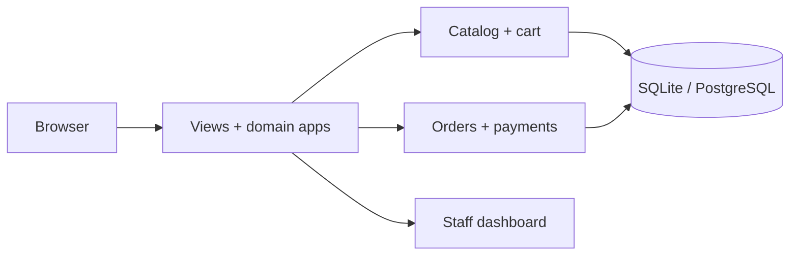

<div align="center">


**[🌐 English](README.md) · [🇮🇷 فارسی](README.fa.md)**

</div>

<div dir="rtl">

# 🛒 SHOP 01 · DJANGO

**کشف محصول ← سبد خرید ← ثبت سفارش ← مدیریت فروش**

یک تجربهٔ خرید با پشتوانهٔ مدیریتی: محصول را پیدا کن، گزینه‌ها را مقایسه کن، تنوع دلخواه را انتخاب کن و سفارش را ثبت کن. پشت ویترین، Django حساب مشتری، سبد خرید، موجودی، پرداخت و مدیریت سفارش را در یک برنامه به هم متصل می‌کند.

| در یک نگاه | داخل پروژه |
|:---|:---|
| 🎯 تمرکز | ویترین، تجربهٔ مشتری و مدیریت |
| 🧰 Stack | Python · Django · SQLite / PostgreSQL · Pillow · cryptography |
| 🌐 راهنما | [English](README.md) · [فارسی](README.fa.md) |
| 🎨 تصویر | [Animated](assets/readme/hero.gif) · [Static](assets/readme/hero.png) |

[✨ تجربهٔ خرید](#experience) · [🚀 اجرای محلی](#setup) · [🧱 معماری](#architecture) · [🌍 استقرار](#deployment)

<a id="experience"></a>

## ✨ از اولین جست‌وجو تا سفارش بعدی

| قابلیت | تجربه |
|:---|:---|
| 🔎 کشف محصول | پیشنهاد جست‌وجو، صفحهٔ دسته و برند، فیلتر قیمت، مرتب‌سازی و مقایسهٔ محصول. |
| 🎛️ جزئیات محصول | تصاویر، مشخصات و انتخاب تنوع محصول. |
| 🛒 تداوم سبد خرید | سبد مهمان و مشتری، تغییر تعداد و ادغام سبد هنگام ورود. |
| 🏠 پنل مشتری | حساب کاربری، آدرس‌ها، علاقه‌مندی‌ها و مشاهدهٔ سفارش‌ها. |
| 🎟️ ثبت سفارش | انتخاب آدرس، کوپن، محاسبهٔ ارسال و کنترل موجودی هنگام ثبت سفارش. |
| 💳 پرداخت | درگاه آزمایشی تعاملی محلی و آداپتور زرین‌پال در سورس. |
| 📦 مدیریت فروش | پردازش سفارش، نمایش موجودی، ویرایش محصول و خروجی CSV سفارش‌ها. |
| ⭐ دیدگاه‌ها | روند ثبت دیدگاه محصول در کنار صفحه‌های فروشگاه و مشتری. |
| 🌐 تجربهٔ کاربری | طراحی فروشگاه فارسی، تنظیمات بومی‌سازی و هویت قابل تنظیم سایت. |

### 🧭 یک دور در فروشگاه

1. در `/shop/` محصولات را مرور، فیلتر و مقایسه کن.
2. تنوع محصول را انتخاب و به `/cart/` اضافه کن.
3. وارد حساب شو، آدرس را انتخاب کن و در `/orders/checkout/` ادامه بده.
4. پرداخت آزمایشی را کامل کن و سفارش را در پنل مشتری و `/dashboard/` ببین.

| مسیر | کاربرد |
|:---|:---|
| `/shop/` | فهرست، فیلتر و مقایسه |
| `/cart/` | سبد خرید |
| `/orders/checkout/` | ثبت سفارش |
| `/dashboard/` | مدیریت فروش |
| `/admin/` | مدیریت Django |

<a id="setup"></a>

## 🚀 اجرای محلی

Python 3.12+ و pip؛ SQLite ساده‌ترین مسیر محلی است. PostgreSQL به درایور و سرور پیکربندی‌شده نیاز دارد.

<div dir="ltr">

```bash
git clone https://github.com/MOHAMMADREZAABEDINPOOR/shop.git
cd shop

python -m venv .venv
# macOS/Linux: source .venv/bin/activate
# Windows PowerShell: .\.venv\Scripts\Activate.ps1
python -m pip install -r requirements.txt
# Copy .env.example to .env and set your local keys.
python manage.py migrate
python manage.py seed_data
python manage.py runserver
```

</div>

قبل از migration، `.env.example` را به `.env` کپی کن. برای ساخت `SECRET_KEY` از `python -c "from django.core.management.utils import get_random_secret_key; print(get_random_secret_key())"` و برای `DATA_ENCRYPTION_KEY` مستقل از `python -c "from cryptography.fernet import Fernet; print(Fernet.generate_key().decode())"` استفاده کن. کلید رمزنگاری را در `.env` نگه دار و برای خواندن داده‌های قبلی تغییرش نده.

آدرس **http://127.0.0.1:8000** را باز کن؛ سرور داخلی برای توسعهٔ محلی است.

### 🧪 حساب‌های نمونه

این حساب‌ها با seed محلی ساخته می‌شوند؛ فقط برای پایگاه دادهٔ تازه و نمونه‌اند. پیش از میزبانی عمومی، حساب‌ها و رمزهای نمونه را جایگزین کن.

| نقش | Email | رمز نمونه |
|:---|:---|:---|
| Admin | `admin@shop.local` | `AdminPass1234!` |
| Staff | `staff@shop.local` | `StaffPass1234!` |
| Customer | `customer1@shop.local` | `CustomerPass1234!` |

## ⚙️ تنظیمات کاربردی

از [`.env.example`](.env.example) شروع کن؛ مقادیر واقعی در `.env` محلی یا محیط میزبان قرار بگیرند.

| تنظیم | کاربرد |
|:---|:---|
| `SECRET_KEY` | کلید امضا و نشست Django؛ مقدار مستقل تنظیم کن. |
| `DEBUG / ALLOWED_HOSTS` | حالت توسعه و دامنه‌های مجاز. |
| `DATABASE_URL` | خالی برای SQLite؛ رشتهٔ اتصال postgres:// برای PostgreSQL. |
| `DATA_ENCRYPTION_KEY` | کلید اختصاصی Fernet برای فیلدهای رمزنگاری‌شده. |
| `PAYMENT_GATEWAY_DEFAULT` | پیش‌فرض توسعهٔ محلی sandbox است. |
| `ZARINPAL_MERCHANT_ID` | شناسهٔ پذیرنده برای آداپتور زرین‌پال. |
| `EMAIL_BACKEND / EMAIL_HOST*` | ایمیل کنسولی محلی؛ برای ارسال واقعی SMTP را تنظیم کن. |

<a id="architecture"></a>

## 🧱 اجزای برنامه چگونه کنار هم کار می‌کنند

<div dir="ltr">



</div>

| مسیر | مسئولیت |
|:---|:---|
| [`shop_project/`](shop_project/) | تنظیمات، مسیرها و WSGI |
| [`catalog/`](catalog/) | محصول، تنوع، فیلتر و مقایسه |
| [`accounts/`](accounts/) | کاربر، آدرس و اطلاعات مشتری |
| [`cart/`](cart/) · [`orders/`](orders/) · [`payments/`](payments/) | دامنه‌های سبد، سفارش و پرداخت |
| [`dashboard/`](dashboard/) | مدیریت فروش و گزارش‌ها |
| [`templates/`](templates/) · [`static/`](static/) | قالب‌ها و فایل‌های رابط |

## 💳 رفتار واقعی پرداخت

درگاه پیش‌فرض آزمایشی است و کارت واقعی را شارژ نمی‌کند. آداپتور زرین‌پال در سورس وجود دارد؛ استفادهٔ واقعی به حساب پذیرنده، callback صحیح و اعتبارسنجی اتصال به سرویس نیاز دارد. تغییر متغیر محیطی به‌تنهایی به معنی تأیید پرداخت واقعی نیست.

<a id="deployment"></a>

## 🌍 از اجرای محلی تا میزبانی

از سرور برنامهٔ Python پشت HTTPS استفاده کن؛ static و media را جدا سرو کن، `DEBUG=False`، دامنه‌های مجاز و کلیدهای مستقل را تنظیم و از پایگاه داده و فایل‌های آپلودشده نسخهٔ پشتیبان تهیه کن. برای PostgreSQL، `psycopg[binary]` را صریح نصب کن. [DEPLOYMENT.md](DEPLOYMENT.md) مسیر Gunicorn/Nginx/PostgreSQL و [SECURITY.md](SECURITY.md) کنترل‌های برنامه را توضیح می‌دهند.

## 🧪 بررسی‌های توسعه‌دهندگان

| دستور | هدف |
|:---|:---|
| `python manage.py check` | بررسی ساختار Django |
| `python manage.py test catalog cart orders payments` | آزمون دامنه‌های فروش |
| `python manage.py collectstatic --noinput` | جمع‌آوری فایل‌های استاتیک |

این‌ها دستورهای بررسی موجودند؛ فهرست آن‌ها به معنی اجرای آزمون کامل برنامه در این تغییر مستندات نیست.

## 🧩 رفع اشکال

| نشانه | راهکار |
|:---|:---|
| درایور PostgreSQL نصب نیست | `psycopg[binary]` را در محیط فعال نصب کن. |
| تصاویر دیده نمی‌شوند | مسیر `media/`، رکورد تصویر محصول و تنظیم سرو فایل را بررسی کن. |
| ثبت سفارش متوقف شده | آدرس و موجودی فعلی محصول و تنوع آن را بررسی کن. |

## 🧭 سه رویکرد به ساخت فروشگاه

| پروژه | رویکرد |
|:---|:---|
| [SHOP 01](https://github.com/MOHAMMADREZAABEDINPOOR/shop) | دامنه‌های Django، سفارش با کنترل موجودی و داشبورد فروش |
| [SHOP 02](https://github.com/MOHAMMADREZAABEDINPOOR/shop2) | سرویس‌های Laravel، تنوع محصول و مدیریت با نقش |
| [NEXTSHOP](https://github.com/MOHAMMADREZAABEDINPOOR/shop3) | PHP مستقیم، MVC و روتر کوچک و آماده‌سازی SQLite |

## 🤝 بازخورد و مشارکت

در issue، صفحه، رفتار مورد انتظار و مراحل بازتولید را بنویس. تغییر کد را در شاخهٔ مشخص و همراه بررسی مرتبط انجام بده.

[Issues](https://github.com/MOHAMMADREZAABEDINPOOR/shop/issues) · [PIMX](https://github.com/MOHAMMADREZAABEDINPOOR)

## 📄 مجوز

در این نسخه فایل مجوز در سطح مخزن وجود ندارد؛ برای شرایط استفادهٔ مجدد با مالک هماهنگ کن.

---

<div align="center">

🛒 **SHOP 01 · DJANGO** · [English](README.md) · [فارسی](README.fa.md)

</div>

</div>
