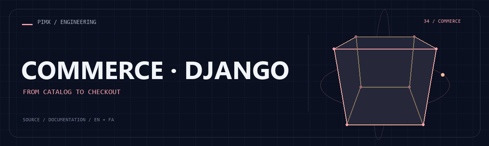
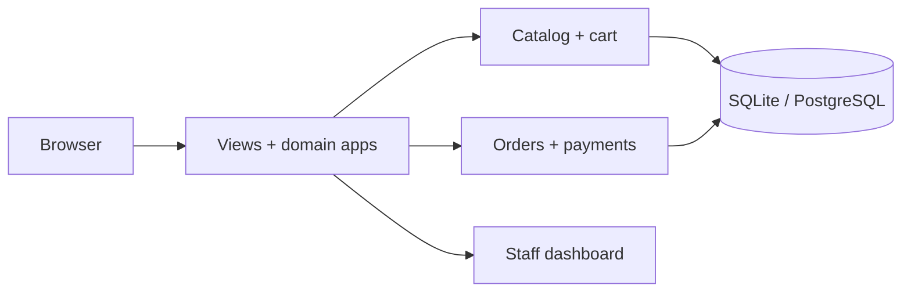

<div align="center">



**[🌐 English](README.md) · [🇮🇷 فارسی](README.fa.md)**

</div>

# 🛒 SHOP 01 · DJANGO

**DISCOVERY → CART → CHECKOUT → OPERATIONS**

A shopping experience with an operational backbone: discover products, compare options, choose a variant and complete checkout. Behind the storefront, Django ties customer accounts, carts, stock, payments and order management into one application.

| At a glance | What is inside |
|:---|:---|
| 🎯 Focus | Storefront, customer journey and administration |
| 🧰 Stack | Python · Django · SQLite / PostgreSQL · Pillow · cryptography |
| 🌐 Documentation | [English](README.md) · [فارسی](README.fa.md) |
| 🎨 Artwork | [Animated](assets/readme/hero.gif) · [Static](assets/readme/hero.png) |

[✨ Experience](#experience) · [🚀 Run locally](#setup) · [🧱 Architecture](#architecture) · [🌍 Deployment](#deployment)

<a id="experience"></a>

## ✨ From the first search to the next order

| Capability | Experience |
|:---|:---|
| 🔎 Product discovery | Search suggestions, category/brand pages, price filtering, sorting and product comparison. |
| 🎛️ Product detail | Product images, specifications and variant-aware choices. |
| 🛒 Cart continuity | Guest and customer carts, quantity changes and cart merge on sign-in. |
| 🏠 Customer area | Accounts, saved addresses, wishlists and order views. |
| 🎟️ Checkout | Address selection, coupons, shipping totals and a stock-aware checkout flow. |
| 💳 Payments | An interactive local sandbox plus a ZarinPal adapter in the source. |
| 📦 Operations | Order processing, inventory views, product editing and CSV order export. |
| ⭐ Reviews | Product review workflows alongside catalog and customer pages. |
| 🌐 Presentation | Persian storefront styling, localization settings and configurable site branding. |

### 🧭 Take a tour

1. Browse `/shop/`, use filters and compare products.
2. Choose a product variant and add it to `/cart/`.
3. Sign in, choose an address and continue at `/orders/checkout/`.
4. Complete the local payment sandbox; inspect the order in customer views and `/dashboard/`.

| Route | Purpose |
|:---|:---|
| `/shop/` | Catalog, filtering and comparison |
| `/cart/` | Cart |
| `/orders/checkout/` | Checkout |
| `/dashboard/` | Staff operations |
| `/admin/` | Django administration |

<a id="setup"></a>

## 🚀 Run it locally

Python 3.12+ and pip. SQLite is the simplest local database; PostgreSQL requires its driver and a configured server.

```bash
git clone https://github.com/MOHAMMADREZAABEDINPOOR/shop.git
cd shop

python -m venv .venv
# macOS/Linux: source .venv/bin/activate
# Windows PowerShell: .\.venv\Scripts\Activate.ps1
python -m pip install -r requirements.txt
# Copy .env.example to .env and set your local keys.
python manage.py migrate
python manage.py seed_data
python manage.py runserver
```

Copy `.env.example` to `.env` before migrations. For example, generate `SECRET_KEY` with `python -c "from django.core.management.utils import get_random_secret_key; print(get_random_secret_key())"`. Generate a separate `DATA_ENCRYPTION_KEY` with `python -c "from cryptography.fernet import Fernet; print(Fernet.generate_key().decode())"` and save it in `.env`. Keep it stable to read existing encrypted fields.

Open **http://127.0.0.1:8000**. The built-in server is for local development.

### 🧪 Demo accounts

Created by the local seed workflow. Use them only in a fresh demonstration database; replace seeded accounts/passwords before public hosting.

| Role | Email | Demo password |
|:---|:---|:---|
| Admin | `admin@shop.local` | `AdminPass1234!` |
| Staff | `staff@shop.local` | `StaffPass1234!` |
| Customer | `customer1@shop.local` | `CustomerPass1234!` |

## ⚙️ Configuration that matters

Start from [`.env.example`](.env.example); keep real values in your local `.env` or hosting environment.

| Setting | Role |
|:---|:---|
| `SECRET_KEY` | Django signing/session secret; set your own value. |
| `DEBUG / ALLOWED_HOSTS` | Debug mode and allowed domains. |
| `DATABASE_URL` | Empty for SQLite; postgres:// connection for PostgreSQL. |
| `DATA_ENCRYPTION_KEY` | Dedicated Fernet key for encrypted data fields. |
| `PAYMENT_GATEWAY_DEFAULT` | Local development defaults to sandbox. |
| `ZARINPAL_MERCHANT_ID` | Merchant identifier used by the ZarinPal adapter. |
| `EMAIL_BACKEND / EMAIL_HOST*` | Console email locally; configure SMTP to deliver messages. |

<a id="architecture"></a>

## 🧱 How the application fits together



| Path | Responsibility |
|:---|:---|
| [`shop_project/`](shop_project/) | Django settings, URLs and WSGI |
| [`catalog/`](catalog/) | Products, variants, filters and comparisons |
| [`accounts/`](accounts/) | Users, addresses and customer records |
| [`cart/`](cart/) · [`orders/`](orders/) · [`payments/`](payments/) | Cart, checkout and payment domains |
| [`dashboard/`](dashboard/) | Staff workflows and reports |
| [`templates/`](templates/) · [`static/`](static/) | Storefront templates and assets |

## 💳 Payment behavior

The default gateway is a local sandbox and does not charge a real card. The source includes a ZarinPal adapter; production use needs a merchant account, correct callback URLs and provider-specific verification. Do not treat changing an environment variable as proof that a live payment integration has been validated.

<a id="deployment"></a>

## 🌍 From local development to hosting

Use a Python application server behind HTTPS; serve static/media files separately, set `DEBUG=False`, allowed domains and dedicated secrets, and back up the database and uploaded media. For PostgreSQL install `psycopg[binary]` explicitly. [DEPLOYMENT.md](DEPLOYMENT.md) describes a Gunicorn/Nginx/PostgreSQL setup; [SECURITY.md](SECURITY.md) documents application controls.

## 🧪 Checks for developers

| Command | Purpose |
|:---|:---|
| `python manage.py check` | Django system checks |
| `python manage.py test catalog cart orders payments` | Relevant domain tests |
| `python manage.py collectstatic --noinput` | Prepare static files for a deployment |

These are available validation commands, not a claim that the full application was tested during this documentation update.

## 🧩 Troubleshooting

| Symptom | Try this |
|:---|:---|
| Missing PostgreSQL driver | Install `psycopg[binary]` in the active environment. |
| Missing images | Check `media/`, product image records and your media serving configuration. |
| Checkout blocked | Choose an address and verify current product/variant stock. |

## 🧭 Three approaches to commerce

| Project | Approach |
|:---|:---|
| [SHOP 01](https://github.com/MOHAMMADREZAABEDINPOOR/shop) | Django domain apps, stock-aware ordering and an operations dashboard |
| [SHOP 02](https://github.com/MOHAMMADREZAABEDINPOOR/shop2) | Laravel services, product variants and a role-gated back office |
| [NEXTSHOP](https://github.com/MOHAMMADREZAABEDINPOOR/shop3) | Direct PHP, a small MVC/router layer and SQLite bootstrap |

## 🤝 Feedback & contribution

Open an issue with the page, expected behavior and steps to reproduce. For code changes, use a focused branch and the relevant checks.

[Issues](https://github.com/MOHAMMADREZAABEDINPOOR/shop/issues) · [PIMX](https://github.com/MOHAMMADREZAABEDINPOOR)

## 📄 License

This snapshot has no repository-level license file. Contact the owner for reuse terms.

---

<div align="center">

🛒 **SHOP 01 · DJANGO** · [English](README.md) · [فارسی](README.fa.md)

</div>
